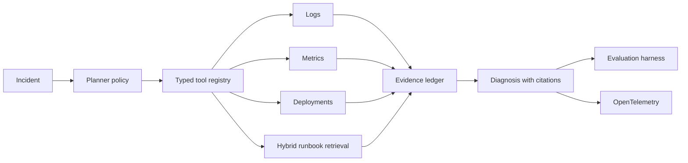

# RootSignal

**Train, serve, and evaluate tool-using LLM agents on reproducible production incidents.**

[](https://github.com/medhavee-upadhyaya/rootsignal-bench/actions/workflows/ci.yml)
[](LICENSE)
[](pyproject.toml)
[](docs/RESULTS.md)
[](https://github.com/medhavee-upadhyaya/rootsignal-bench/actions/workflows/security.yml)
[](CHANGELOG.md)

RootSignal is an open benchmark and production reference system for AI agents that investigate failures using logs, metrics, traces, runbooks, and deployment history. It makes the entire LLM systems lifecycle inspectable: dataset construction, retrieval, tool use, fine-tuning, inference, evaluation, observability, and deployment.

The working application uses a persistent SQLite FTS5 knowledge base, read-only diagnostic tools, and an OpenAI-compatible local model server. The same inference client targets llama.cpp for laptop development and vLLM for production GPU serving.

> Status: `v0.2` working reference system. The deterministic policy is an explicitly labeled plumbing baseline; model results are reported separately and include failures.

**Built for:** LLM systems engineers comparing agent architectures, SRE and platform teams prototyping evidence-grounded incident response, and researchers who need reproducible tool-use evaluation instead of one-off demos.

[Quickstart](#five-minute-quickstart) · [Measured results](docs/RESULTS.md) · [Benchmark contract](docs/BENCHMARK.md) · [Architecture](docs/ARCHITECTURE.md) · [Deployment](docs/DEPLOYMENT.md) · [Releasing](docs/RELEASING.md) · [Contributing](CONTRIBUTING.md)

## What you can do with RootSignal

| Workflow | Concrete output |
|---|---|
| Replay a production incident | Evidence-grounded diagnosis with citations and remediation |
| Compare agent or model changes | Paired scorecards, confidence intervals, slice reports, and regression gates |
| Evaluate retrieval changes | Recall@k, MRR, strategy ablation, and auditable reranking scores |
| Train a tool selector | Template-isolated train/eval data, LoRA entry point, and artifact manifests |
| Benchmark model serving | TTFT, latency, token throughput, concurrency sweep, and SLO verdict |
| Operate the application | Metrics, traces, structured events, alerts, dashboards, and health probes |

## What makes this different

Most agent demos grade the final prose. RootSignal Bench grades the investigation itself.

| Layer | Measured evidence |
|---|---|
| Retrieval | Hybrid lexical/semantic fusion, Recall@k, MRR, and provenance |
| Tool use | Tool selection and argument validity |
| Investigation | Required evidence collected and unsupported claims |
| Outcome | Root-cause accuracy and remediation coverage |
| Systems | Time-to-first-token, latency, throughput, tokens, and cost |

## Five-minute quickstart

```bash
python -m incidentlab.cli investigate fixtures/incidents/checkout_latency.yaml
python -m unittest discover -s tests -v
```

This path is deterministic, offline, and requires no model credentials. For the interactive model-backed workspace, continue to [Run the full product](#run-the-full-product). A guided end-to-end walkthrough is available in [docs/DEMO.md](docs/DEMO.md).

### Run the full product

Start the API:

```bash
pip install -e '.[api]'
uvicorn incidentlab.api:app --reload
```

In a second terminal, start the web workspace:

```bash
cd web
npm install
npm run dev
```

Open `http://localhost:3000` for the complete investigation workspace. The web server proxies investigation requests to the API at `http://127.0.0.1:8000`; set `INCIDENTLAB_API_URL` to use another backend.

The UI can ingest runbooks and operational notes directly. Documents are chunked, content-addressed, deduplicated, indexed, retrieved during the agent run, and returned with source provenance.

Run the API (requires the optional API dependencies):

```bash
pip install -e '.[api]'
uvicorn incidentlab.api:app --reload
curl -X POST http://localhost:8000/v1/investigations \
  -H 'content-type: application/json' \
  -d '{"incident_id":"checkout-latency-001"}'
```

## Example result

```text
Root cause: Deployment v1.8.3 exhausted the checkout-api database pool.
Confidence: 0.94
Evidence:
  - p95 latency increased from 240 ms to 2.8 s after v1.8.3
  - db.pool.wait_ms increased to 1830 ms while CPU remained normal
  - v1.8.3 reduced DB_POOL_SIZE from 40 to 10
Remediation: restore DB_POOL_SIZE=40, roll back v1.8.3, and alert on pool wait time.
```

## Architecture



The policy is a replaceable boundary. The same incident fixtures and typed tools can evaluate a deterministic baseline, a hosted model, or a fine-tuned local model served through an OpenAI-compatible endpoint.

For a local model server, construct `OpenAICompatiblePolicy(base_url, model)` and pass it to `Investigator`. The adapter intentionally shares the same contract across vLLM and hosted-compatible endpoints.

## Repository map

```text
incidentlab/           Core agent, retrieval, tools, API, telemetry, CLI
fixtures/incidents/    Replayable benchmark incidents
evals/                 Evaluation runner and scorecards
training/              Dataset builder and LoRA training entry point
benchmarks/            Inference/load benchmark
deploy/                Docker, Compose, Kubernetes, and dashboards
tests/                 Unit and end-to-end regression tests
docs/                  Design, benchmark, model, and security documentation
```

## Benchmark contract

Every incident contains observable telemetry, distractors, a private oracle, expected tools, evidence requirements, and remediation criteria. The agent never receives the oracle. See [docs/BENCHMARK.md](docs/BENCHMARK.md).

Run the scorecard:

```bash
python -m evals.run --fixtures fixtures/incidents
```

### Current measured baseline

| System | Incidents | Overall | Tool selection | Evidence coverage | Citation validity | Mean latency |
|---|---:|---:|---:|---:|---:|---:|
| Qwen3-1.7B GGUF · llama.cpp CPU | 5 | 0.662 | 0.950 | 0.650 | 1.000 | 8.8s |

Retrieval currently reaches Recall@2 of `1.000` and MRR of `0.900` across the five public-observation scenarios. These are development measurements on an Apple M4 with 16 GB unified memory, not universal performance claims. The full machine-readable result is in `benchmarks/results/`.

Evaluate the actual running local model separately from the oracle-backed plumbing baseline:

```bash
python -m evals.live --fixtures fixtures/incidents
```

## Fine-tuning

RootSignal fine-tunes tool selection rather than conversational style. Training examples map an incident state and available tool schemas to the next valid tool call. This gives a measurable target and keeps diagnosis grounded in collected evidence.

```bash
python -m training.build_dataset --fixtures fixtures/incidents --output work/tool_calls.jsonl
python -m training.train_lora --dataset work/tool_calls.jsonl --model <base-model>
```

The optional training command requires the `train` dependency group and a CUDA-capable environment. It records the base model, seed, dataset digest, configuration, and adapter output. A validated Tesla T4 run, including exact model revision, held-out loss, hardware metadata, and artifact hashes, is published in [results/gpu/](results/gpu/) with a clean [Colab notebook](notebooks/rootsignal_gpu_training.ipynb). See [docs/MODEL_CARD.md](docs/MODEL_CARD.md).

## Inference performance

The serving contract is OpenAI-compatible. The API load test measures complete investigation requests:

```bash
python -m benchmarks.load_test --url http://localhost:8000/v1/investigations --requests 100 --concurrency 8
```

The streaming inference benchmark targets vLLM or another compatible model server:

```bash
python -m benchmarks.inference \
  --model <model-id> \
  --model-revision <commit> \
  --hardware "1x NVIDIA L4 24GB" \
  --concurrency-sweep 1,2,4,8,16 \
  --output work/vllm-result.json
```

It records TTFT, end-to-end percentiles, request and output-token throughput, failures, warmups, concurrency, model/runtime settings, hardware, and SLO results. It exits nonzero when a gate fails. Compare matching runs with `python -m benchmarks.compare baseline.json candidate.json`. A measured Tesla T4 vLLM sweep is published in [benchmarks/results/](benchmarks/results/) with exact environment evidence and a [reproducible Colab notebook](notebooks/rootsignal_vllm_benchmark.ipynb). See [the inference benchmark protocol](docs/INFERENCE_BENCHMARK.md). Publish hardware-specific results rather than universal performance claims.

## Production posture

- Structured evidence and bounded tool budgets
- Input validation and tool allowlists
- Correlation IDs, structured errors, security headers, and configurable rate limiting
- OpenTelemetry spans and Prometheus-compatible metrics endpoint
- Versioned Grafana dashboard, Prometheus alerts, structured JSON events, and grounding signals
- Health/readiness endpoints
- Container image, Compose stack, and Kubernetes manifests
- Non-root API and web images, persistent data, safe rollouts, autoscaling, SBOMs, and provenance
- CI tests, evaluation regression gate, dependency review, and image build
- Credential-free end-to-end provider test across API, agent, tools, RAG, citations, and telemetry
- Explicit threat model and documented limitations

The observability contract intentionally separates service health from model quality: HTTP and latency SLOs detect availability problems, while citation and planner-fallback metrics detect degraded agent behavior. See [production observability and runbooks](docs/OBSERVABILITY.md).

For deployment, `docker compose up --build` runs the complete web and API stack. Version tags build multi-architecture release images with SBOM and provenance attestations. See [the deployment guide](docs/DEPLOYMENT.md).

## Roadmap

- [x] Reproducible end-to-end incident and deterministic baseline
- [x] Typed tools, evidence ledger, retrieval, API, CLI, and regression tests
- [x] Evaluation, artifact-validated training pipeline, streaming inference benchmark, and deployment stack
- [ ] 50 human-reviewed benchmark incidents across five failure classes
- [ ] Hosted-model and local-model scorecards
- [x] Reproducible LoRA GPU training evidence with validated manifests
- [ ] Public LoRA adapter weights and downstream ablations
- [x] Measured vLLM Tesla T4 concurrency sweep with TTFT and throughput
- [ ] GPU inference matrix across additional quantization and batch configurations
- [ ] Community leaderboard with signed result manifests

See [measured results](docs/RESULTS.md), the [architecture decision record](docs/ARCHITECTURE.md), and the [threat model](docs/THREAT_MODEL.md) before interpreting scores.

## Contributing

Start with [CONTRIBUTING.md](CONTRIBUTING.md). New incidents are especially valuable, but must pass schema validation, avoid secrets, include distractors, and provide an evidence-backed oracle.

## License

Apache-2.0. See [LICENSE](LICENSE).
